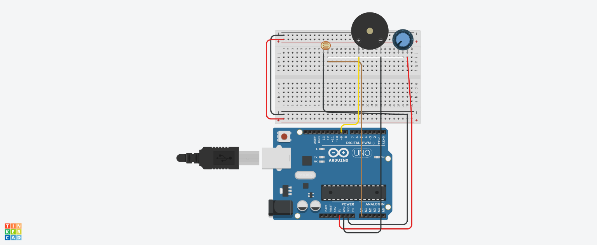

# LDR-Based Threshold Alarm System

An automated, light-sensitive threshold alarm system built with Arduino, utilizing an LDR voltage divider and an active buzzer.

## Technical Specifications
- **Controller:** Arduino Uno
- **Input:** LDR (Photoresistor) + 10kΩ Potentiometer (Voltage Divider Network)
- **Output:** Active Buzzer (Driven via Digital Pin 8)
- **Logic State:** Binary (Open/Closed Loop)

## How It Works
Unlike continuous analog control (PWM), this system acts as a digital logic trigger. It samples analog input from the environment and performs a direct comparison against a preset **threshold** value. 
* If the ambient light level drops below the established setpoint (simulating a dark environment or a closed space opening), the condition is met, and a 1kHz square wave tone is generated.
* This logic forms the foundational principle for industrial light barriers, drawer alarms, and automated security triggers.

## Circuit Diagram

## Installation & Calibration
1. Clone this repository and open `src/LightAlarm.ino` in the Arduino IDE.
2. Upload the code to your Arduino board.
3. Open the Serial Monitor (9600 baud).
4. **Calibration:** Observe the raw ADC values printed on the monitor. Adjust the `alarmThreshold` variable in the code to match the specific light conditions of your target environment.

## Academic Context
Developed as a foundational exercise in embedded systems, focusing on binary state control, conditional triggers, and real-time analog signal processing.
